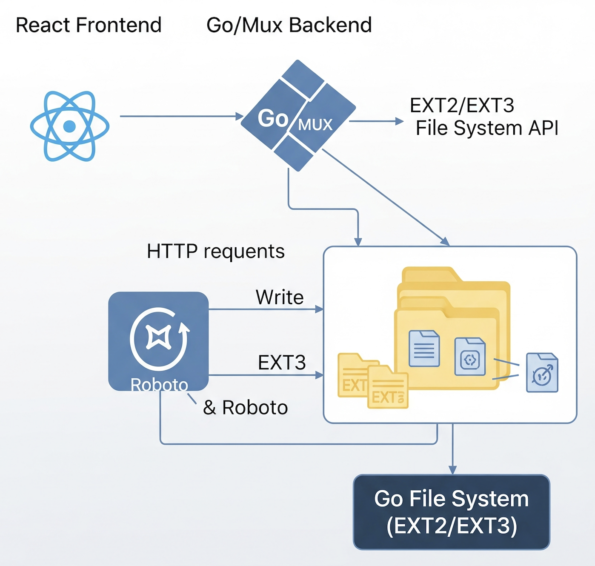
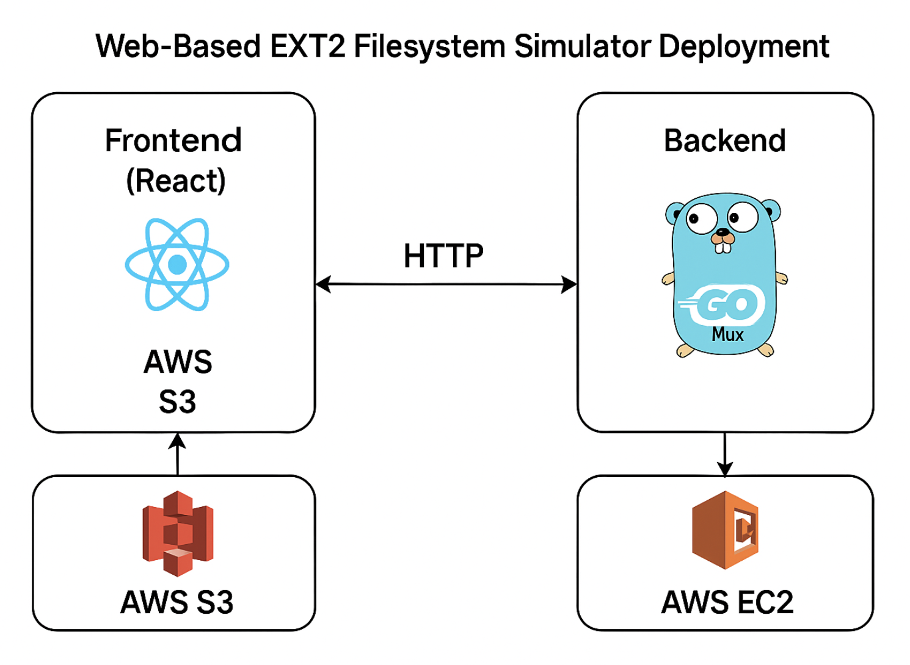

# 📘 Manual Técnico - Sistema de Archivos Web EXT2

Este manual técnico proporciona una visión completa del funcionamiento interno y uso del sistema de archivos EXT2 simulado en esta aplicación web, incluyendo su implementación, arquitectura, estructuras de datos y lógica de funcionamiento, así como su despliegue en AWS.

## 📄 Tabla de Contenidos

1.  [📌 Objetivos](#objetivos)
    * [Objetivo General](#objetivo-general)
    * [Objetivos Específicos](#objetivos-especificos)
2.  [🌐 Alcances del Sistema](#alcances-del-sistema)
    * [Gestión de Discos](#gestión-de-discos)
    * [Gestión de Particiones](#gestión-de-particiones)
    * [Montaje](#montaje)
    * [Formateo](#formateo)
    * [Gestión de Usuarios y Grupos](#gestión-de-usuarios-y-grupos)
    * [Gestión de Archivos y Directorios](#gestión-de-archivos-y-directorios)
    * [Generación de Reportes](#generación-de-reportes)
3.  [⚙️ Requisitos Técnicos](#requisitos-técnicos)
    * [Requisitos de Hardware](#requisitos-de-hardware)
    * [Requisitos de Software](#requisitos-de-software)
4.  [📐 Arquitectura del Sistema](#arquitectura-del-sistema)
    * [Estructura General y Conexión](#estructura-general-y-conexión)
    * [Arquitectura de Despliegue en AWS](#arquitectura-de-despliegue-en-aws)
5.  [🧱 Estructuras de Datos en Go y Gestión en el Archivo Binario](#estructuras-de-datos-en-go-y-gestión-en-el-archivo-binario)
    * [MBR](#mbr)
    * [EBR](#ebr)
    * [Partition](#partition)
    * [Superblock](#superblock)
    * [Inode](#inode)
    * [Bloques de Datos](#bloques-de-datos)
        * [Fileblock](#fileblock)
        * [Folderblock](#folderblock)
        * [Pointerblock](#pointerblock)
    * [Journaling](#journaling)
        * [Content_J](#content_j)
        * [Journaling](#journaling-1)
6.  [🔁 Endpoints REST API (Go + Mux)](#endpoints-rest-api-go--mux)
    * [Autenticación](#autenticación)
    * [Discos](#discos)
    * [Exploración de Archivos](#exploración-de-archivos)
    * [Subida de Archivos](#subida-de-archivos)
7.  [🧰 Funciones Importantes en Go](#funciones-importantes-en-go)
    * [Login](#login)
    * [Mkfile](#mkfile)
    * [Rmusr](#rmusr)
    * [UpdateInodeFileData](#updateinodefiledata)
    * [Generación de Reportes](#generación-de-reportes-1)
8.  [💻 Código en React](#código-en-react)
    * [Login](#login-1)
    * [Explorador de Archivos](#explorador-de-archivos)
    * [Subir Archivos](#subir-archivos)
9.  [📂 Comandos Soportados](#comandos-soportados)
10. [☁️ Consideraciones de Despliegue](#consideraciones-de-despliegue)
11. [📎 Observaciones Finales](#observaciones-finales)

---

## 📌 Objetivos

### Objetivo General

- Describir detalladamente la implementación, arquitectura, estructuras de datos y lógica de funcionamiento del simulador de sistema de archivos EXT2, facilitando su comprensión, uso y mantenimiento futuro en el contexto del curso de Manejo e Implementación de Archivos.

### Objetivos Específicos

- Explicar en detalle las estructuras de datos clave que simulan los componentes de un disco y un sistema de archivos EXT2 (MBR, Particiones, EBR, SuperBloque, Inodos, Bloques de Datos/Carpetas/Punteros, Bitmaps).
- Presentar la arquitectura Cliente-Servidor utilizada (Frontend React.js y Backend Go).
- Detallar el proceso de serialización y deserialización de estas estructuras hacia/desde un archivo binario que representa el disco virtual.

## 🌐 Alcances del Sistema

Este sistema simula la creación y gestión de discos virtuales y sistemas de archivos basados en la estructura EXT2. El alcance funcional incluye:

### Gestión de Discos

- Creación de discos virtuales (mkdisk) con tamaño y ajuste especificados (BF, FF, WF).
- Eliminación de discos virtuales (rmdisk).

### Gestión de Particiones

- Creación de particiones Primarias (fdisk -type=P).
- Creación de partición Extendida (fdisk -type=E) (máximo una por disco).
- Creación de particiones Lógicas (fdisk -type=L) dentro de la Extendida, utilizando EBRs encadenados.

### Montaje

- Montaje de particiones Primarias y Lógicas (mount) asignando un ID único.
- Listado de particiones montadas (mounted).

### Formateo

- Creación de un sistema de archivos EXT2 (mkfs) en una partición montada, incluyendo:
    - Cálculo de número de inodos y bloques ($n$).
    - Escritura del SuperBloque.
    - Inicialización de Bitmaps de Inodos y Bloques.
    - Creación del Inodo raíz (/).
    - Creación del archivo /users.txt con el usuario root inicial.

### Gestión de Usuarios y Grupos

- Inicio de sesión (login) validando contra /users.txt.
- Cierre de sesión (logout).
- Creación de grupos (mkgrp).
- Eliminación de grupos (rmgrp) (excepto root).
- Creación de usuarios (mkusr) asignados a un grupo existente.
- Eliminación de usuarios (rmusr) (excepto root).
- Cambio de grupo para un usuario (chgrp).

### Gestión de Archivos y Directorios

- Creación de directorios (mkdir), incluyendo creación recursiva de padres (-p).
- Creación de archivos (mkfile), con contenido opcional desde tamaño (-size) o archivo local (-cont), y creación recursiva de padres (-r). Soporta indirección simple y doble (triple pendiente).
- Visualización de contenido de archivos (cat).

### Generación de Reportes

- Generación de reportes gráficos (rep) usando Graphviz sobre: MBR (mbr), Disco (disk), SuperBloque (sb), Bitmaps (bm\_inode, bm\_block), Tabla de Inodos (inode), Bloques Usados (block), Árbol de Directorios/Archivos (tree), Contenido de Archivo (file), Listado tipo ls -l (ls).

---

## ⚙️ Requisitos Técnicos

### Requisitos de Hardware

- **Memoria RAM:** 2GB (Recomendado 4GB+ para ejecución fluida, especialmente con discos grandes).
- **Espacio en Disco:** 1GB libre (para el código fuente, Go, Node.js, y los discos virtuales generados).
- **Procesador:** 1GHz x64 o superior.
- Pantalla
- Teclado
- Mouse (opcional)

### Requisitos de Software

- **Sistema Operativo:** Compatible con Go y Node.js (Linux [Mint/Ubuntu recomendado], macOS, Windows).
- **Go:** Versión 1.18 o superior
- **Node.js:** Versión LTS recomendada (Verificar con `node -v`). Incluye `npm`.
- **Vue CLI:** (Si se usa para gestionar el frontend Vue)
- **Graphviz:** Necesario para generar los reportes gráficos. Debe estar instalado y el comando `dot` accesible desde el PATH del sistema (Verificar con `dot -V`).
- **IDE/Editor:** Visual Studio Code (recomendado) con extensiones para Go y React.js, u otro editor/IDE de preferencia.
- **Terminal/Consola:** Para compilar y ejecutar el backend/frontend.

---

## 📐 Arquitectura del Sistema

### Estructura General y Conexión

El sistema está compuesto por dos grandes módulos que interactúan entre sí para simular un sistema de archivos completo:

-   **Frontend (React)**: Es la interfaz de usuario con la que el usuario final interactúa. Simula un explorador de archivos y un terminal, permitiendo la ejecución de comandos y la visualización del estado del sistema de archivos. Está desarrollado utilizando React.js para una experiencia de usuario dinámica y responsiva.
-   **Backend (Go)**: Es el corazón del sistema, encargado de la lógica de simulación del sistema de archivos EXT3. Controla la gestión de discos, particiones, archivos, carpetas, permisos, usuarios, grupos y la generación de reportes. Está implementado en Go, lo que le confiere alta eficiencia y concurrencia.

La comunicación entre el **Frontend** y el **Backend** se realiza mediante el protocolo HTTP, siguiendo un modelo de **API RESTful**. El frontend utiliza funciones estándar de JavaScript como `fetch` o librerías como `axios` para enviar solicitudes (GET, POST, etc.) al backend. El backend, construido con el framework `mux` de Go, expone una serie de endpoints RESTful que procesan estas solicitudes, manipulan el disco virtual (representado como un archivo binario `.dsk`), y devuelven las respuestas correspondientes en formato JSON. Esta separación clara de responsabilidades entre cliente y servidor permite un desarrollo modular y escalable.



### Arquitectura de Despliegue en AWS

El sistema está diseñado para un despliegue en la nube utilizando Amazon Web Services (AWS), lo que garantiza accesibilidad, escalabilidad y robustez.

-   **Frontend (Static Web Hosting en S3)**: La interfaz de usuario de React se compila en un conjunto de archivos estáticos (HTML, CSS, JavaScript, imágenes). Estos archivos son subidos a un **bucket de Amazon S3**, el cual está configurado para funcionar como un sitio web estático. Esto proporciona una solución de hosting de bajo costo, alta disponibilidad y escalabilidad, ya que S3 maneja automáticamente el tráfico web. Para mejorar la entrega de contenido y reducir la latencia, se podría integrar **Amazon CloudFront** como una CDN (Content Delivery Network) frente al bucket S3, aunque no se menciona explícitamente en el diagrama original.
-   **Backend (Instancia EC2)**: El servidor Go, que ejecuta la lógica del sistema de archivos, se despliega en una instancia de **Amazon EC2 (Elastic Compute Cloud)**. Se utiliza una instancia con sistema operativo Ubuntu 22.04, donde Go (versión 1.21+) está instalado y el backend se ejecuta como un servicio. Esta instancia EC2 actúa como el servidor de aplicaciones que procesa todas las peticiones de la API REST. Los discos virtuales (`.bin` o `.dsk` en la práctica) se almacenan persistente en un directorio específico dentro de esta instancia EC2, comúnmente `/home/ubuntu/app/fs/test/`. Para asegurar la conectividad entre el frontend y el backend, se configuran las reglas de **Grupos de Seguridad (Security Groups)** en EC2 para permitir el tráfico HTTP/HTTPS entrante al puerto donde escucha el backend (generalmente 80 o 443).
-   **Comunicación Segura y Accesibilidad**: Para permitir que el frontend, alojado en S3, pueda comunicarse con el backend en EC2, es crucial configurar las políticas de **CORS (Cross-Origin Resource Sharing)** en el backend de Go. Estas políticas se configuran para permitir peticiones desde el dominio donde está alojado el bucket S3 del frontend, garantizando que el navegador no bloquee las solicitudes por seguridad de origen cruzado.

Esta arquitectura de despliegue en AWS proporciona una solución robusta y escalable, separando el hosting de la interfaz de usuario de la lógica de negocio, lo que permite actualizaciones independientes y una gestión eficiente de recursos.



---

## 🧱 Estructuras de Datos en Go y Gestión en el Archivo Binario

A continuación, se documentan detalladamente las estructuras de datos clave utilizadas para simular el sistema de archivos, incluyendo su propósito y los campos que las componen. Estas estructuras son serializadas y deserializadas directamente hacia y desde un archivo binario (`.dsk` o `.bin`) que representa el disco virtual. La gestión en el archivo binario se basa en la escritura y lectura de estos bloques de datos en posiciones de byte específicas, lo que simula la persistencia en un disco real.

### MBR

La estructura **`MBR`** (Master Boot Record) representa el primer sector de un disco virtual y siempre se encuentra en el offset $0$ del archivo `.dsk`. Contiene información vital para el arranque y la gestión de particiones.

```go
type MRB struct {
    MbrSize      int32        // Tamaño total del disco virtual en bytes.
    CreationDate [10]byte     // Fecha y hora de creación del disco.
    Signature    int32        // Número de firma único para el MBR.
    Fit          [1]byte      // Indica la estrategia de ajuste (ajuste en 'B'est, 'F'irst, o 'W'orst).
    Partitions   [4]Partition // Arreglo de 4 particiones, que representan las particiones primarias en el disco.
}
```

**Gestión en .dsk:** El MBR es la primera estructura en ser escrita en el archivo. Su tamaño fijo permite que las operaciones de lectura y escritura siempre comiencen en el byte $0$ del archivo.

### EBR

La estructura **`EBR`** (Extended Boot Record) es utilizada para gestionar particiones lógicas dentro de una partición extendida. Cada partición lógica tiene su propio EBR. Los EBRs se encadenan entre sí, formando una lista enlazada, donde `PartNext` apunta al inicio del siguiente EBR. Cada EBR se almacena *justo antes* de la partición lógica que describe.

```go
type EBR struct {
    PartStatus int32     // Estado de la partición (ej. 1 para activa, 0 para inactiva).
    PartFit    [1]byte   // Estrategia de ajuste para la partición lógica.
    PartStart  int32     // Posición inicial de la partición en el disco (en bytes).
    PartSize   int32     // Tamaño de la partición en bytes.
    PartNext   int32     // Puntero al siguiente EBR en la lista enlazada de particiones lógicas. Si es 0, no hay más.
    PartName   [16]byte  // Nombre de la partición.
}
```

**Gestión en .dsk:** Los EBRs se escriben en el archivo `.dsk` en las posiciones de inicio de cada partición lógica. La correcta navegación de la lista enlazada (usando `PartNext`) es crucial para localizar y manipular particiones lógicas.

### Partition

La estructura **`Partition`** define una partición individual dentro del MBR. Las 4 estructuras `Partition` están contenidas dentro del `MBR`.

```go
type Partition struct {
    Status      [1]byte  // Estado de la partición ('1' para activa, '0' para inactiva).
    Type        [1]byte  // Tipo de partición ('P'rimaria, 'E'xtendida o 'L'ógica).
    Fit         [1]byte  // Estrategia de ajuste para la partición.
    Start       int32    // Posición de inicio de la partición en el disco (en bytes).
    Size        int32    // Tamaño de la partición en bytes.
    Name        [16]byte // Nombre de la partición.
    Correlative int32    // Número correlativo de la partición.
    Id          [4]byte  // Identificador único de la partición.
}
```

**Gestión en .dsk:** Al ser parte del MBR, sus datos se leen y escriben junto con el MBR. Sus campos `Start` y `Size` son fundamentales para ubicar el área de datos de la partición dentro del archivo `.dsk`.

### Superblock

El **`Superblock`** contiene los metadatos más importantes del sistema de archivos EXT2. Se escribe al inicio del área de datos de una partición formateada (EXT2), justo después del EBR si es una partición lógica, o después del MBR si es una primaria.

```go
type Superblock struct {
    S_filesystem_type   int32      // Tipo de sistema de archivos (ej. 2 para EXT2).
    S_inodes_count      int32      // Número total de inodos en el sistema de archivos.
    S_blocks_count      int32      // Número total de bloques de datos en el sistema de archivos.
    S_free_blocks_count int32      // Número de bloques de datos libres.
    S_free_inodes_count int32      // Número de inodos libres.
    S_mtime             [17]byte   // Última fecha y hora de montaje.
    S_umtime            [17]byte   // Última fecha y hora de desmontaje.
    S_mnt_count         int32      // Conteo de montajes.
    S_magic             int32      // Número mágico para identificar el sistema de archivos (0xEF53 para EXT2).
    S_inode_size        int32      // Tamaño de un inodo en bytes.
    S_block_size        int32      // Tamaño de un bloque en bytes.
    S_fist_ino          int32      // Primer inodo libre.
    S_first_blo         int32      // Primer bloque libre.
    S_bm_inode_start    int32      // Posición de inicio del bitmap de inodos.
    S_bm_block_start    int32      // Posición de inicio del bitmap de bloques.
    S_inode_start       int32      // Posición de inicio de la tabla de inodos.
    S_block_start       int32      // Posición de inicio de la tabla de bloques.
}
```

**Gestión en .dsk:** El Superblock se escribe al inicio del espacio asignado a la partición. Sus campos `S_bm_inode_start`, `S_bm_block_start`, `S_inode_start`, y `S_block_start` son punteros de byte dentro de la partición que indican dónde se encuentran el bitmap de inodos, el bitmap de bloques, la tabla de inodos y la tabla de bloques, respectivamente. Esto permite al sistema de archivos navegar a las diferentes estructuras clave.

### Inode

La estructura **`Inode`** representa un nodo de índice y almacena los metadatos de un archivo o directorio. Los Inodos se almacenan secuencialmente en la tabla de inodos (Inode Table), cuya posición de inicio está definida en el Superblock (`S_inode_start`).

```go
type Inode struct {
    I_uid   int32       // ID del usuario propietario.
    I_gid   int32       // ID del grupo propietario.
    I_size  int32       // Tamaño del archivo en bytes.
    I_atime [17]byte    // Última fecha y hora de acceso.
    I_ctime [17]byte    // Fecha y hora de creación.
    I_mtime [17]byte    // Última fecha y hora de modificación.
    I_block [15]int32   // Arreglo de 15 punteros a bloques.
                        // Los primeros 12 son directos, el 13 es de indirección simple, el 14 doble, y el 15 triple (no implementado).
    I_type  [1]byte     // Tipo de inodo ('1' para archivo, '2' para directorio).
    I_perm  [3]byte     // Permisos de usuario, grupo y otros.
}
```

**Gestión en .dsk:** Cada inodo se ubica en la tabla de inodos calculando su offset como `S_inode_start + (número_de_inodo * S_inode_size)`. Los punteros `I_block` son índices a bloques de datos que se encuentran en la sección de bloques de datos del archivo `.dsk`.

### Bloques de datos

El sistema de archivos utiliza diferentes tipos de bloques para almacenar la información. Estos bloques se encuentran en la sección de bloques de datos, cuya posición de inicio está definida en el Superblock (`S_block_start`).

#### Fileblock

Un **`Fileblock`** es un bloque que almacena el contenido de un archivo.

```go
type Fileblock struct {
    B_content [64]byte // Contenido del archivo, hasta 64 bytes.
}
```

**Gestión en .dsk:** Cada Fileblock se ubica en la sección de bloques de datos calculando su offset como `S_block_start + (número_de_bloque * S_block_size)`.

#### Folderblock

Un **`Folderblock`** almacena las entradas de un directorio, vinculando nombres de archivos/directorios a sus inodos correspondientes.

```go
type Content struct {
    B_name  [12]byte // Nombre del archivo o directorio.
    B_inodo int32    // Número de inodo asociado.
}

type Folderblock struct {
    B_content [4]Content // Arreglo de 4 estructuras Content, cada una representando una entrada.
}
```

**Gestión en .dsk:** Similar a los Fileblocks, los Folderblocks se ubican en la sección de bloques de datos utilizando su índice de bloque.

#### Pointerblock

Un **`Pointerblock`** es un bloque de indirección que contiene punteros a otros bloques de datos o de punteros, permitiendo almacenar archivos grandes.

```go
type Pointerblock struct {
    B_pointers [16]int32 // Arreglo de 16 punteros a otros bloques.
}
```

**Gestión en .dsk:** Los Pointerblocks también se almacenan en la sección de bloques de datos. Los valores dentro de `B_pointers` son índices a otros bloques dentro de la misma sección, permitiendo la construcción de una estructura de árbol para archivos grandes.

### Journaling

El sistema de **`Journaling`** se utiliza para registrar operaciones antes de que se escriban en el disco, permitiendo la recuperación del sistema de archivos en caso de fallos. El Journaling se encuentra en una zona específica dentro de la partición formateada (EXT2), usualmente después del Superblock y los Bitmaps, pero antes de la tabla de inodos.

#### Content\_J

La estructura **`Content_J`** representa una entrada individual en el registro de transacciones (journal).

```go
type Content_J struct {
    Operation [10]byte  // Tipo de operación realizada (ej. "MKDIR", "MKFILE").
    Path      [100]byte // Ruta del archivo o directorio afectado.
    Content   [100]byte // Contenido o información adicional de la operación.
    Date      [17]byte  // Fecha y hora de la operación.
}
```

#### Journaling

La estructura **`Journaling`** representa el registro completo de transacciones.

```go
type Journaling struct {
    Size      int32        // Tamaño total del registro.
    Ultimo    int32        // Índice de la última entrada de contenido.
    Contenido [50]Content_J // Arreglo de 50 entradas de registro.
}
```

**Gestión en .dsk:** La estructura `Journaling` se escribe en una posición predefinida dentro del sistema de archivos de la partición. Cada operación que modifica el sistema de archivos (crear, borrar, modificar) primero se registra como una entrada `Content_J` en el `Contenido` del `Journaling`. Si el sistema falla, el proceso de recuperación puede leer el `Journaling` para rehacer o deshacer operaciones incompletas, garantizando la consistencia del sistema de archivos.

-----

## 🔁 Endpoints REST API (Go + Mux)

El backend de Go expone una serie de endpoints RESTful para interactuar con el simulador del sistema de archivos.

### Autenticación

  - **Endpoint:** `POST /api/auth/login`
  - **Descripción:** Permite a un usuario iniciar sesión en el sistema simulado.
  - **Cuerpo de la Petición (JSON):**
    ```json
    {
      "user": "root",
      "pass": "123",
      "id": "A110" // ID de la partición montada donde se realizará el login
    }
    ```

### Discos

  - **Endpoint:** `GET /api/disks`

  - **Descripción:** Retorna una lista de todos los discos virtuales disponibles y sus particiones.

  - **Endpoint:** `GET /api/disks/{driveLetter}/partitions`

  - **Descripción:** Retorna las particiones de un disco específico, identificado por su letra de unidad.

### Exploración de Archivos

  - **Endpoint:** `GET /api/fs?path=/home/user`

  - **Descripción:** Retorna el contenido de un directorio (archivos y subdirectorios) en la ruta especificada.

  - **Endpoint:** `GET /api/fs/content?path=/home/user/docs/file.txt`

  - **Descripción:** Retorna el contenido textual de un archivo específico en la ruta dada.

### Subida de Archivos

  - **Endpoint:** `POST /api/files/upload`
  - **Descripción:** Permite subir un archivo al sistema de archivos simulado.
  - **Cuerpo de la Petición:** `multipart/form-data`
    ```
    Content-Type: multipart/form-data
    ```

-----

## 🧰 Funciones Importantes en Go

Estas son algunas de las funciones clave implementadas en el backend de Go que manejan la lógica del sistema de archivos.

### Login

```go
func Login(user, pass, id string) {
  // Abre el archivo binario del disco virtual asociado al 'id' de la partición.
  // Busca el inodo correspondiente al archivo /users.txt dentro de la partición.
  // Lee el contenido de /users.txt para obtener la lista de usuarios y sus credenciales.
  // Verifica si el 'user' y 'pass' proporcionados coinciden con algún registro.
  // Si las credenciales son válidas, habilita la sesión para el usuario en el contexto del simulador.
  // Podría actualizar un estado interno o retornar un token/sesión ID al frontend.
}
```

### Mkfile

```go
func Mkfile(path string, size int, r bool, cont string) {
  // Parsea la 'path' para determinar el directorio padre y el nombre del nuevo archivo.
  // Si 'r' es true (recursivo), crea los directorios padres si no existen.
  // Busca un inodo libre en el bitmap de inodos de la partición.
  // Si se especifica 'size', inicializa el archivo con el tamaño dado (rellenando con ceros o contenido predefinido).
  // Si se especifica 'cont' (contenido desde archivo local), lee el contenido y lo escribe en los bloques.
  // Asigna bloques de datos libres (directos e indirectos, según el tamaño) del bitmap de bloques.
  // Escribe el contenido del archivo en los bloques de datos asignados.
  // Actualiza los punteros a bloques en el inodo del nuevo archivo.
  // Escribe el inodo actualizado en la tabla de inodos.
  // Actualiza el Folderblock del directorio padre para incluir la nueva entrada del archivo y su inodo.
  // Actualiza los bitmaps de inodos y bloques marcando los utilizados.
  // Registra la operación en el Journaling.
}
```

### Rmusr

```go
func Rmusr(user string) {
  // Abre el archivo binario del disco y la partición.
  // Localiza el inodo y los bloques de datos asociados a /users.txt.
  // Lee el contenido de /users.txt.
  // Busca la línea correspondiente al 'user' especificado.
  // Modifica la línea para marcar lógicamente al usuario como inactivo (ej. cambiando su estado a '0').
  // Sobrescribe los bloques de datos de /users.txt con el contenido modificado.
  // Actualiza los metadatos del inodo de /users.txt (ej. I_mtime).
  // Registra la operación en el Journaling.
}
```

### UpdateInodeFileData

```go
func UpdateInodeFileData(...) error {
  // Esta función es una utilidad interna que se encarga de:
  // - Leer el inodo de un archivo/directorio de la tabla de inodos.
  // - Sobrescribir los bloques de datos asociados al inodo con contenido nuevo o modificado.
  // - Actualizar los punteros a bloques dentro del inodo si el tamaño del archivo cambia (añadiendo/liberando bloques).
  // - Escribir el inodo modificado de vuelta en la tabla de inodos en el archivo .dsk.
  // - Manejar la indirección de bloques (simple, doble, triple) según sea necesario para archivos grandes.
  // - Actualizar los bitmaps de bloques y inodos si se asignan o liberan recursos.
  // - Es fundamental para operaciones como 'mkfile' (con contenido), 'cat' (si se implementara escritura), etc.
}
```

### Generación de Reportes

```go
func GenerarReporteMBR(path string, id string) {
  // Lee el MBR del disco asociado al 'id'.
  // Genera un archivo .dot que describe la estructura del MBR y sus particiones.
  // Utiliza Graphviz para renderizar el .dot a una imagen (ej. .png o .svg) en la 'path' especificada.
}
func GenerarReporteBMBlock(path string, id string) {
  // Lee el Superblock de la partición del 'id' para obtener la posición y tamaño del bitmap de bloques.
  // Lee el bitmap de bloques completo desde el archivo .dsk.
  // Genera una representación visual (ej. una tabla o un gráfico) del estado de cada bloque (libre/ocupado).
  // Exporta el reporte a un archivo de imagen o texto en la 'path' dada.
}
func GenerarReporteFile(id, path, ruta string) {
  // Localiza el inodo correspondiente al archivo en la 'ruta' dentro de la partición del 'id'.
  // Recorre los punteros de bloque del inodo (directos e indirectos) para leer todo el contenido del archivo.
  // Genera un reporte que muestra el contenido del archivo.
  // Puede incluir metadatos del inodo y cómo se distribuyen los bloques.
  // Exporta el reporte a un archivo de texto o imagen en la 'path' especificada.
}
// Se espera que haya funciones similares para otros reportes (Disco, SuperBloque, Tabla de Inodos, etc.).
```

-----

## 💻 Código en React

El frontend de React interactúa con el backend de Go para proporcionar una interfaz gráfica al usuario.

### Login

```jsx
// src/components/Login.jsx (Ejemplo)
import React, { useState } from 'react';

const Login = () => {
  const [user, setUser] = useState('');
  const [pass, setPass] = useState('');
  const [id, setId] = useState('');
  const [message, setMessage] = useState('');

  const handleLogin = async () => {
    try {
      const res = await fetch('/api/auth/login', {
        method: 'POST',
        headers: { 'Content-Type': 'application/json' },
        body: JSON.stringify({ user, pass, id })
      });
      const data = await res.json();
      if (res.ok) {
        setMessage(`Inicio de sesión exitoso: ${data.message}`);
        // Aquí se podría manejar la redirección o el estado de autenticación global
      } else {
        setMessage(`Error de inicio de sesión: ${data.error}`);
      }
      console.log(data);
    } catch (error) {
      console.error("Error al intentar iniciar sesión:", error);
      setMessage("Error de conexión con el servidor.");
    }
  };

  return (
    <div className="login-container">
      <h2>Iniciar Sesión</h2>
      <input
        type="text"
        placeholder="Usuario"
        value={user}
        onChange={(e) => setUser(e.target.value)}
      />
      <input
        type="password"
        placeholder="Contraseña"
        value={pass}
        onChange={(e) => setPass(e.target.value)}
      />
      <input
        type="text"
        placeholder="ID de Partición (Ej. A110)"
        value={id}
        onChange={(e) => setId(e.target.value)}
      />
      <button onClick={handleLogin}>Login</button>
      {message && <p>{message}</p>}
    </div>
  );
};

export default Login;
```

### Explorador de Archivos

```jsx
// src/components/FileManager.jsx (Ejemplo)
import React, { useState, useEffect } from 'react';

const FileManager = () => {
  const [currentPath, setCurrentPath] = useState('/');
  const [files, setFiles] = useState([]);
  const [errorMessage, setErrorMessage] = useState('');

  useEffect(() => {
    const fetchFiles = async () => {
      try {
        const res = await fetch(`/api/fs?path=${encodeURIComponent(currentPath)}`);
        if (!res.ok) {
          const errorData = await res.json();
          throw new Error(errorData.error || `HTTP error! status: ${res.status}`);
        }
        const data = await res.json();
        setFiles(data);
        setErrorMessage('');
      } catch (error) {
        console.error("Error al obtener archivos:", error);
        setErrorMessage(`No se pudo cargar el contenido del directorio: ${error.message}`);
        setFiles([]); // Limpiar archivos en caso de error
      }
    };
    fetchFiles();
  }, [currentPath]); // Dependencia para recargar cuando cambia la ruta

  const navigateTo = (folderName) => {
    const newPath = folderName === '..'
      ? currentPath.substring(0, currentPath.lastIndexOf('/')) || '/'
      : `${currentPath === '/' ? '' : currentPath}/${folderName}`;
    setCurrentPath(newPath);
  };

  const viewFileContent = async (filePath) => {
    try {
      const res = await fetch(`/api/fs/content?path=${encodeURIComponent(filePath)}`);
      if (!res.ok) {
        const errorData = await res.json();
        throw new Error(errorData.error || `HTTP error! status: ${res.status}`);
      }
      const data = await res.json();
      alert(`Contenido de ${filePath}:\n\n${data.content}`); // Usar un modal en vez de alert en prod
    } catch (error) {
      console.error("Error al ver contenido del archivo:", error);
      alert(`Error al cargar el contenido: ${error.message}`);
    }
  };

  return (
    <div className="file-manager-container">
      <h3>Explorador de Archivos: {currentPath}</h3>
      {errorMessage && <p className="error-message">{errorMessage}</p>}
      <button onClick={() => navigateTo('..')} disabled={currentPath === '/'}>
        Subir Directorio (..)
      </button>
      <ul>
        {files.map((item) => (
          <li key={item.name} onClick={() => item.is_directory ? navigateTo(item.name) : viewFileContent(`${currentPath === '/' ? '' : currentPath}/${item.name}`)}>
            {item.is_directory ? '📁' : '📄'} {item.name}
          </li>
        ))}
      </ul>
    </div>
  );
};

export default FileManager;
```

### Subir Archivos

```jsx
// src/components/FileUpload.jsx (Ejemplo)
import React, { useState } from 'react';

const FileUpload = ({ currentPath }) => {
  const [selectedFile, setSelectedFile] = useState(null);
  const [uploadMessage, setUploadMessage] = useState('');

  const handleFileChange = (event) => {
    setSelectedFile(event.target.files[0]);
    setUploadMessage('');
  };

  const handleUpload = async () => {
    if (!selectedFile) {
      setUploadMessage('Por favor, selecciona un archivo primero.');
      return;
    }

    const formData = new FormData();
    formData.append('file', selectedFile);
    formData.append('destinationPath', currentPath); // Envía la ruta actual al backend

    try {
      const res = await fetch('/api/files/upload', {
        method: 'POST',
        body: formData // No Content-Type es necesario para FormData
      });

      const data = await res.json();
      if (res.ok) {
        setUploadMessage(`Archivo subido exitosamente: ${data.message}`);
        setSelectedFile(null); // Limpiar selección de archivo
        // Opcional: Actualizar la lista de archivos en el FileManager
      } else {
        setUploadMessage(`Error al subir archivo: ${data.error}`);
      }
      console.log(data);
    } catch (error) {
      console.error("Error al subir archivo:", error);
      setUploadMessage("Error de conexión al subir el archivo.");
    }
  };

  return (
    <div className="file-upload-container">
      <h3>Subir Archivo</h3>
      <input type="file" onChange={handleFileChange} />
      <button onClick={handleUpload} disabled={!selectedFile}>Subir</button>
      {uploadMessage && <p>{uploadMessage}</p>}
    </div>
  );
};

export default FileUpload;
```

-----

## 📂 Comandos Soportados

El simulador de sistema de archivos EXT2 soporta una variedad de comandos que replican las funcionalidades de un sistema de archivos real. Estos comandos pueden ser ejecutados a través de la interfaz de terminal del frontend, la cual a su vez hace llamadas a los endpoints REST del backend.

  - **`mkdisk`**: Crea un nuevo disco virtual con un tamaño y estrategia de ajuste específicos (Best Fit, First Fit, Worst Fit).
  - **`rmdisk`**: Elimina un disco virtual existente.
  - **`fdisk`**: Permite la creación de particiones (Primarias, Extendidas, Lógicas) dentro de un disco.
  - **`mount`**: Monta una partición (primaria o lógica) para hacerla accesible y le asigna un ID único.
  - **`unmount`**: Desmonta una partición previamente montada.
  - **`mkfs`**: Formatea una partición montada con el sistema de archivos EXT2, inicializando el Superblock, Bitmaps, Inodo raíz, y el archivo `/users.txt`.
  - **`login`**: Permite a un usuario iniciar sesión, validando credenciales contra el archivo `/users.txt`.
  - **`logout`**: Cierra la sesión del usuario actual.
  - **`mkgrp`**: Crea un nuevo grupo de usuarios.
  - **`rmgrp`**: Elimina un grupo de usuarios existente (excepto el grupo `root`).
  - **`mkusr`**: Crea un nuevo usuario, asignándolo a un grupo existente.
  - **`rmusr`**: Elimina lógicamente un usuario (excepto el usuario `root`).
  - **`mkfile`**: Crea un nuevo archivo, permitiendo especificar su tamaño inicial o contenido desde un archivo local, con opciones de creación recursiva de directorios padres.
  - **`cat`**: Muestra el contenido de un archivo.
  - **`mkdir`**: Crea uno o varios directorios, con opción de creación recursiva de directorios padres.
  - **`find`**: Busca archivos o directorios por nombre dentro del sistema de archivos.
  - **`rep`**: Genera reportes gráficos utilizando Graphviz sobre diversas estructuras del sistema de archivos (MBR, Disco, SuperBloque, Bitmaps, Inodos, Bloques, Árbol de Directorios/Archivos, Contenido de Archivo, listados tipo `ls -l`).

Todos los comandos son manejados por el backend de Go, que procesa las operaciones en el archivo binario del disco. La salida de estos comandos, especialmente la de los reportes, puede ser transformada para visualizaciones ricas en el frontend.

-----

## ☁️ Consideraciones de Despliegue

El despliegue de este sistema en AWS se ha diseñado para ser eficiente y escalable, dividiendo claramente las responsabilidades entre el frontend y el backend.

  - **Backend (Go en EC2):**

      - El código del backend está desarrollado en Go, compatible con la versión 1.21 o superior.
      - Se despliega en una instancia de **Amazon EC2** (Elastic Compute Cloud), preferiblemente con un sistema operativo como Ubuntu 22.04 LTS para estabilidad y soporte a largo plazo.
      - El ejecutable del backend se configura para correr como un servicio en segundo plano, asegurando su disponibilidad continua.
      - Los archivos binarios que representan los discos virtuales (`.bin` o `.dsk`) se almacenan en una ruta específica y persistente dentro del sistema de archivos de la instancia EC2, como `/home/ubuntu/app/fs/test/`. Es crucial asegurar que este directorio tenga los permisos adecuados para que el proceso Go pueda leer y escribir en él.
      - Las **políticas de seguridad (Security Groups)** en EC2 deben configurarse para permitir el tráfico HTTP (puerto 80) o HTTPS (puerto 443) desde cualquier IP (0.0.0.0/0) o, idealmente, desde el rango de IPs de CloudFront si se usa para el frontend, lo que mejora la seguridad.
      - Se habilita **CORS (Cross-Origin Resource Sharing)** en el backend de Go para permitir que el frontend, que se origina desde un dominio diferente (S3), pueda realizar solicitudes a la API.

  - **Frontend (React en S3):**

      - La aplicación React se construye utilizando `npm run build`, lo que genera una versión optimizada y estática de la aplicación (archivos HTML, CSS, JavaScript, etc.).
      - Estos archivos estáticos son cargados en un **bucket de Amazon S3**.
      - El bucket de S3 se configura para **Static Website Hosting**, lo que lo convierte en un servidor web estático accesible públicamente.
      - Las políticas del bucket deben permitir el acceso público a los objetos (archivos del frontend).
      - Para mejorar el rendimiento y la seguridad, se recomienda enfáticamente colocar una distribución de **Amazon CloudFront** delante del bucket S3. CloudFront actúa como una Content Delivery Network (CDN), almacenando en caché el contenido estático en ubicaciones de borde global para una entrega más rápida y reduciendo la carga directa sobre S3. También permite el uso de certificados SSL/TLS personalizados para comunicaciones HTTPS.

Esta configuración de despliegue facilita el mantenimiento, la escalabilidad y la alta disponibilidad del sistema.

-----

## 📎 Observaciones Finales

  - Este sistema simula de forma realista un sistema de archivos tipo EXT3, ofreciendo una experiencia práctica en el control de bloques, bitmaps, árboles de carpetas, gestión de usuarios y grupos, y aplicación de permisos.
  - El uso de estructuras fundamentales como el MBR, Superbloque, inodos y bloques permite a los estudiantes y desarrolladores comprender y practicar la gestión de archivos como se haría en un sistema operativo real.
  - El modelo cliente-servidor, con un backend robusto en Go y un frontend interactivo en React, facilita la integración con interfaces gráficas modernas y demuestra una arquitectura de aplicación web estándar.
  - Aunque la implementación actual cubre una gran parte de las funcionalidades de EXT2/EXT3, la mención de "triple indirección pendiente" en los inodos indica un área para futuras mejoras, lo que resalta la modularidad del diseño.
